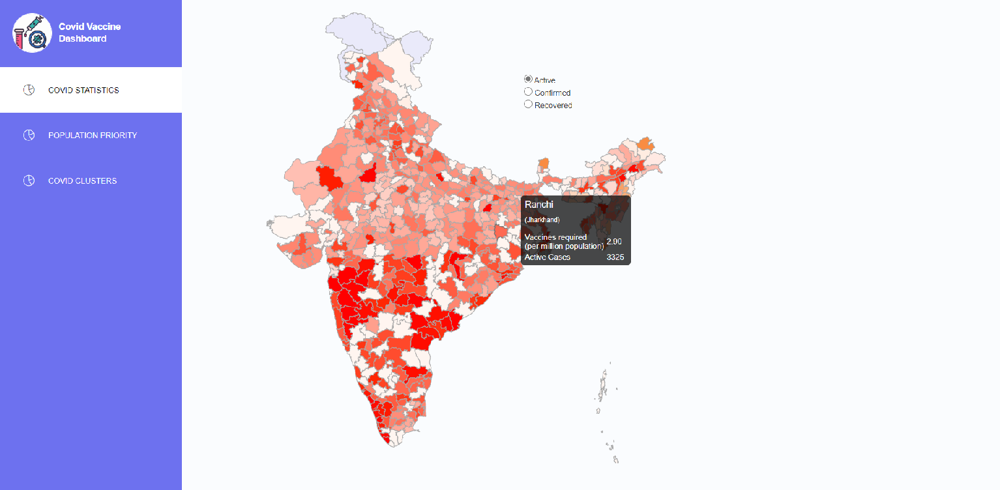
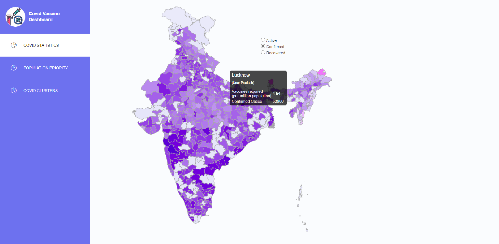
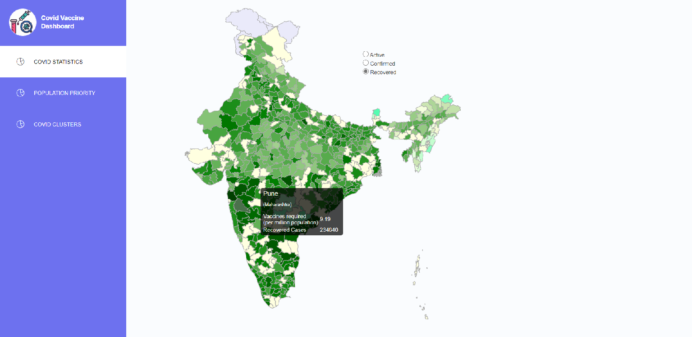
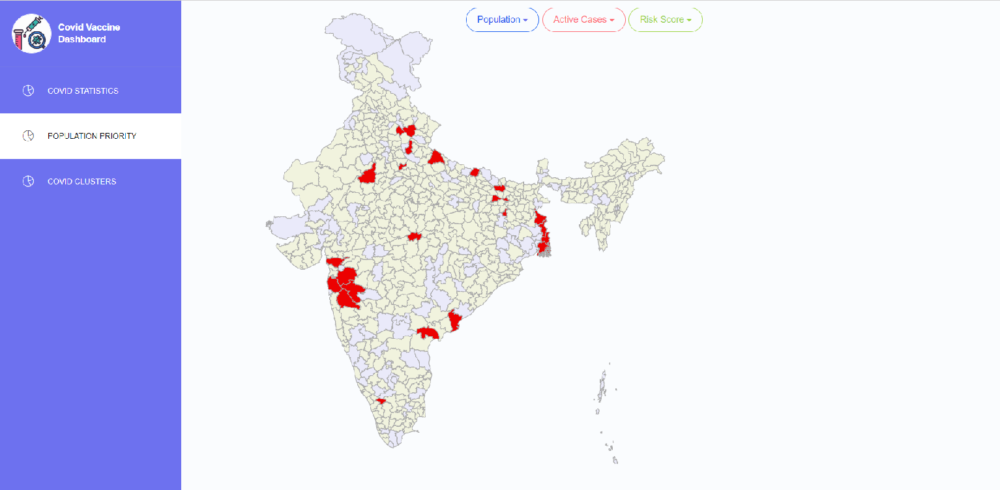
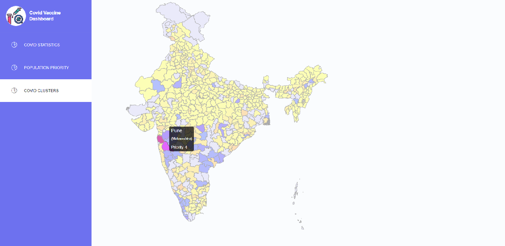

# Project Sanjeevani

A **real-time map pandemic visualizer and constituency-wise risk analyzer interactive website prototype** to help a fair Vaccine distribution system (once released) in the context of Current Covid situation in India to **ease out distribution of Covid during and post pandemic**.

1. Colormapped visualization of recovered, active and confirmed cases.
2. Risk distribution based on statistic formula and visualization on Indian map.
3. Real-time data fetching and updation on frontend to give latest stats.
4. Interactive UI and multiple filters to provide flexibilty of visualization.


# Components

# 1 Covid-Dash-Backend

## 1.1 Processing

### Description
This module written in python does data processing from given api and clusters constituencies based on risk (corona active cases) and writes result into an sqlite3 db, in Database directory.

### Processes
The covid data is being fetched from [api.covid19india.org](https://api.covid19india.org/state_district_wise.json) and census data [2011](http://censusindia.gov.in/2011-Documents/PCA_HL_2011_Release.xls) is being used to fetch population.

**Note: Population has been taken into consideration for different calculations, but ideally population density should be considered for accurate analysis**

1. First the constituencies across India are being clustered with **k-means clustering** and the optimal k value is being estimated with **Elbow method** dynamically in the program.
2. The clusters are ranked based on risk and assigned a non-neg integer named as **priority i.e. 0, 1, 2, 3 etc. (high priority implies high risk)**.
3. To rank the constituencies under a particular cluster the priority is further tuned by adding a fraction within (0 to 0.5). This fracation is being calc as 

**active-cases x log10(population)**

that's normalized within 0-0.5.

4. Each cluster is given different color and higher darkness of color is being given to the clusters dynamically **(i.e. more priority implies darker color)**.
5. Darkness in color for Recovered, Confirmed and Active cases is also being calculated based on counts **(higher count implies darker color)**.

**darkness = normalized(log2(cases))**

6. Data received from sources were dirty and inconsistent containing nulls. Data was cleaned and Null filling methods were applied prior to all processes mentioned above.

### How to run

#### Open main.py notebook file and change the last cell to tune the parameters

#### One time for installing necessary libraries

```pip install -r requirements.txt```

```
cd Covid-Dash-Backend
cd DataProcessor
ipython processor.ipynb or python main.py (both works)
```


## 1.2 Database Server

### Description
This is the backend API service for the Covid-dash 
This module provides api to render data, does data processing from given covid-data fetching api and clusters constituencies based on risk (corona active cases) and writes result into an sqlite3 db, in Database directory.

### How to run

#### One time for installing necessary libraries

```pip install -r requirements.txt```

```
cd Covid-Dash-Backend
cd App
python app.py
```


# 2 Covid-Dash-UI

## 2.1 Frontend

Front-end for this project is built using React.js. Chloropleth Map of India was rendered using D3 library to create a map component. 
The UI consists of three Components :

1. Covid Statistics : A chloropleth map of India showing number of vaccines required per million people(on mouse hover). Normalized values of active, confirmed and recovered Covid Cases are used for coloring the Map. The user can select to view the map based on active, confirmed or recovered covid cases from radio buttons.







2. Parameter Filtering - This interface creates a map which highlights the constituencies based on population, active cases and risk



3. Covid Clusters - This Component creates a Map which shows constituencies grouped as clusters based on risk (corona active cases). The same color defines that the constituencues belong to the same cluster. The intensity of color shows which constituencies in the cluster have a higher priority.


